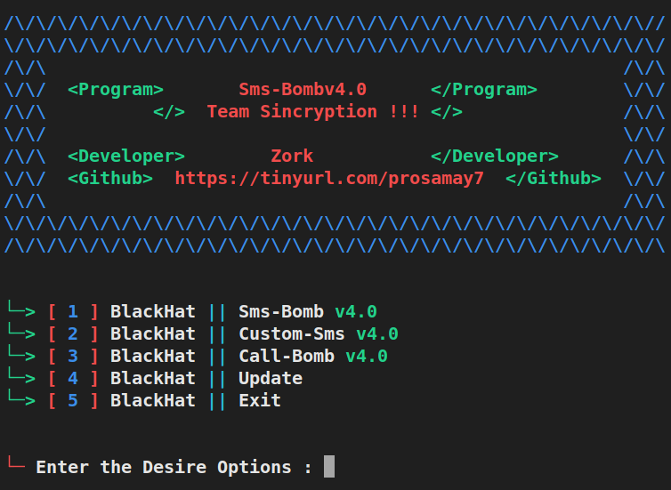

<h1 align="center">Sms-Bombv4.0<br>
</h1>

* `📱 💀`<br />
* `A Sms-Bomber for termux & Linux `

## Disclaimer
*This tool is for educational purposes only !*
_Don't use this to take revenge_<br />
*I will not be responsible for any misuse*

## About
* `Unlimited Bombing only Indian Number`
* `Cross Platform`
* `Supports newest Android also`
* `No balance will be deducted`
* `Working Apis`
* `No missing Api issues,`
* `Working with all Operators/Carriers`

## Tested On :
<ul>
  <li>Kali Linux</li>
  <li>Termux</li>
  <li>Ubuntu</li>
  <li>Parrot Sec OS</li>
  <li>Kali nethunter</li>
  <li>Alpine linux</li>
  
</ul>

## Termux Issue:
* `Termux App is no longer recieving updates on playstore`
* `due to recently introduced Google Play policy `
<br>

DON'T WORRY
* `We have a solution for that !`
<br>


You can download the latest termux app and install it

From here <a href="https://f-droid.org/repo/com.termux_118.apk">Link</a>

## Usage


#### For Termux

Update the packages
```bash
pkg up -y
```
Install some dependencies
```bash
pkg install git wget python -y
```
Clone the repository
```bash
git clone https://github.com/samay825/Sms-Bomb
```
Go to the Sms-Bomb directory
```bash
cd Sms-Bomb
```
Now Install the Requirements 
```bash
pip install -r requirements.txt
```
Run the script
```bash
python3 main.py
```


#### For Debian-based GNU/Linux distributions

Update the packages
```bash
apt-get update; apt-get upgrade -y
```
Install some dependencies
```bash
apt-get install git wget python3 -y
```
Clone the repository
```bash
git clone https://github.com/samay825/Sms-Bomb
```
Go to the Sms-Bomb directory
```bash
cd Sms-Bomb
```
Now Install the Requirements 
```bash
pip install -r requirements.txt
```
Run the script
```bash
sudo python3 main.py
```

## Version
* `v4.0 Sms-Bomb`

## Features
* `B#omb the number unlimited,Custom-sms`

* `Free version speed is in goodflow`

## Note
* `This Sms-Bomb is mainly to prank Friends`

## Licence
Apache 2.0 © Samay825


## Contact Us
* `If you have any feedback or queries`
* `Instagram: @sincryptzork`
* `Telegram: @sincryptzork`

## Telegram Channel

* `All updates of Team Sincryption will be posted here !`
* * `Link : https://t.me/TeamSincryption`

<a href="https://t.me/TeamSincryption">
         


